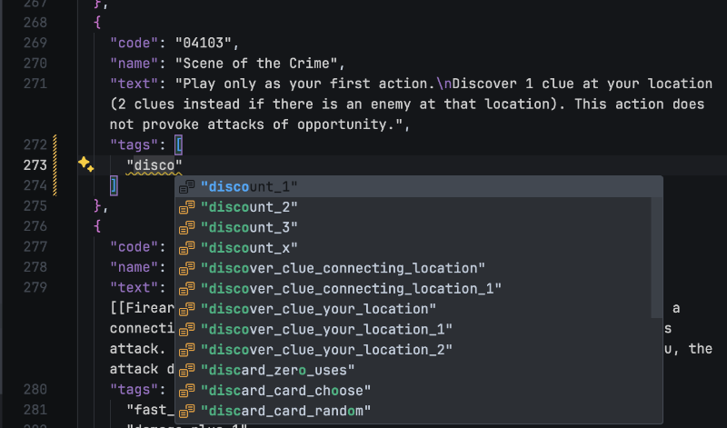

# @5argon/arkham-tags

Tag each Arkham Horror : The Card Game's corresponding to what are contained in its game effect text box. This makes them searchable without having to perform unreliable text processing of what you are interested in.

This is similar to "heal damage" and "heal horror" already in use in arkhamdb card database, because they are needed for Carolyn and Vincent's deckbuilding. This time we are adding tags even through they are not needed for any investigators, but needed for the deckbuilders.

## Status

**This project is still incomplete.** These are hand-tagged already, while the rest are only filled with tags from text processing. Likely there are errors that needs fixing.

- `rcore`
- `dwl`

## Public Facing Contents

- `json/output/tagged-cards.json` is the mapping from card's code to its tags.
- `dist` folder has TypeScript type definitions to work with that JSON (`TaggedCards` type, and `Tags` for union of `string` of all tags available.).

## Examples

- Tags for cards that heal multiple investigators, can heal Ally, can heal multiple Ally, or can heal health and horror at the same time.
- Tags for "spend resorce" inside action, reaction, and fast timing. Tags for gaining resources. Tags for "paying its cost". Tags for play cost discounts. Tags for bringing things "into play" from hand. This allow player to search for what they think are "economy" cards.
- Tags for uses count "support" cards, like refilling or moving secrets. With simple text processing, you would find a lot of simply secrets-using cards.
- Tags for testless damage, evade, and clue. (The so-called "Preston/Carson cards".) Sometimes "deal damage" text occurs inside a non-Fight test that the card could initiate, and text processing might have hard time getting that.
- Tags for enemy management cards such as Disc of Itzamna, Close Call, Waylay, Handcuffs, Fend Off.
- Tags for cards that makes you move, makes other investigator moves, or alter enemy's movement.

## Commands

Please install [Deno](https://deno.com) to use the tag transforming script.

- `sync` : Run every time you are done with working on manually tagging cards in `json/input/pack` to update many files in the project. This includes what goes into the `build` command.
- `build` : Build the `dist` which package consumer access.

## Tagging Workflow

Clone this repository, then open `.vscode/tagging.code-workspace` in Visual Studio Code to get the JSON schema working, and turn on "View: Toggle Word Wrap" so card text wraps to new line even though they are actually one long line. "View: Toggle Zen Mode" is also recommended once you are in the JSON file you want to tag.

Work on files in `input/pack/[pack-name].json`. They have game text available for you to read while tagging. Some untagged cards are already tagged partially, programmatically by Regex, which might be wrong.

The schema warns if you add a completely new tags rather than mistyping it. Ignore the warning if that's your intention. Running `sync` will automatically register those new tags (and clean up previously used tags that are now unused) and the warning will disappear.

If you got the tooling right, each new tags introduced will be underlined, and auto-completion will appear as you type, and the colored bar besides line number show you which part you just added. Please send a Pull Request to integrate your work.

### Learning available tags

In addition to just reading a list of all available tags in `/json/input/tags.json`, try looking at similar cards that are already tagged and you think should share similar tags to discover what's available for use.

For ease of hand-tagging literally to the text, tags defined are very fine-grained. For example if you see "[free] Spend 1 resource :", it should use a more specific tag `cost_free_spend_resource` even though the card is technically also `spend_resource`. However there is no `cost_free_spend_resource_1` to use. Some tag offer numerical value because they are common values, such as `gain_resource_1` or `draw_player_1`.

### Postprocessing

Post process your work in `input/pack/[pack-name].json` with `sync` script in `package.json`. This uses Deno to run the script. It updates files in `json/output`, `json/statistics`, as well as some files in `src` folder. Some of those are what this package exports. One input file `json/input/tags.json` is also updated for each new tags introduced. Here you can type in description, so the next `sync` they became visible in the auto-completion.

In the post processing step, the script adds **additional tags** based on existing tags, using rules defined in `json/input/compound-tags.json`. For example any card with tags starting (prefixed) with `additional_slot_` would automatically get `additional_slot` tag. One can then search for cards that provide any kind of additional slot with that one tag. Person tagging the card also won't have to tag all the more general variations and just use the most specific one.

The `statistics` folder let you analyze where those tags goes to, and further decide to reorganize or remove tags that aren't looking to be too useful.
