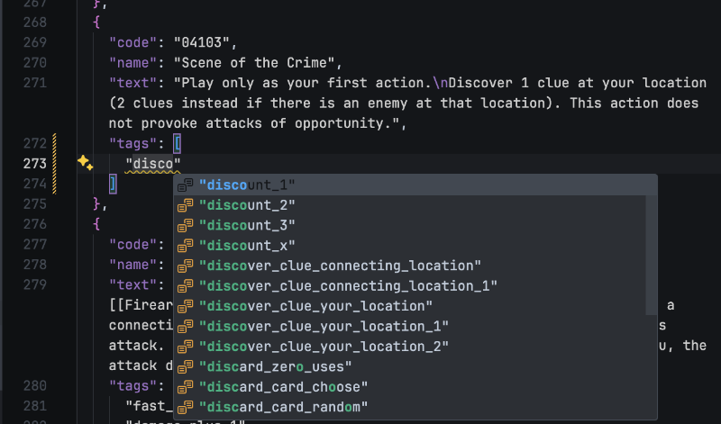

# How to help me tag

Clone this repository, then open `.vscode/tagging.code-workspace` in Visual Studio Code to get the JSON schema working, and turn on "View: Toggle Word Wrap" so card text wraps to new line even though they are actually one long line. "View: Toggle Zen Mode" is also recommended once you are in the JSON file you want to tag.

Work on files in `input/pack/[pack-name].json`. They have game text available for you to read while tagging. Some untagged cards are already tagged partially, programmatically by Regex, which might be wrong.

The schema warns if you add a completely new tags rather than mistyping it. Ignore the warning if that's your intention. Running `sync` will automatically register those new tags (and clean up previously used tags that are now unused) and the warning will disappear.

If you got the tooling right, each new tags introduced will be underlined, and auto-completion will appear as you type, and the colored bar besides line number show you which part you just added. Please send a Pull Request to integrate your work.

## When to add new tags?

Feel free to use your gut feeling because we can always analyze and remove them later.

Basically what you think would be interesting for players to search for. Or if you have technical text processing knowledge, what would be hard to search for. Tags slightly different from existing tags are mostly good to add.

For example defining `kill_investigator` for Charon's Obol would not be very interesting because who'd search for a card that kills you.

## Learning available tags

Detailed documentation is available for some commonly used group of tags (has the same prefix) [here](./common-tags.md).

In addition to just reading a list of all available tags in `/json/input/tags.json`, try looking at similar cards that are already tagged and you think should share similar tags to discover what's available for use.

For ease of hand-tagging literally to the text, tags defined are very fine-grained. For example if you see "[free] Spend 1 resource :", it should use a more specific tag `cost_free_spend_resource` even though the card is technically also `spend_resource`. However there is no `cost_free_spend_resource_1` to use. Some tag offer numerical value because they are common values, such as `gain_resource_1` or `draw_player_1`.

## Postprocessing

Post process your work in `input/pack/[pack-name].json` with `sync` script in `package.json`. This uses Deno to run the script. It updates files in `json/output`, `json/statistics`, as well as some files in `src` folder. Some of those are what this package exports. One input file `json/input/tags.json` is also updated for each new tags introduced. Here you can type in description, so the next `sync` they became visible in the auto-completion.

In the post processing step, the script adds **additional tags** based on existing tags, using rules defined in `json/input/compound-tags.json`. For example any card with tags starting (prefixed) with `additional_slot_` would automatically get `additional_slot` tag. One can then search for cards that provide any kind of additional slot with that one tag. Person tagging the card also won't have to tag all the more general variations and just use the most specific one.

The `statistics` folder let you analyze where those tags goes to, and further decide to reorganize or remove tags that aren't looking to be too useful.

The sync script also sort tags in the input file alphabetically, with special priority of those usually appear first in the text box (Fast. Fast timing. Uses (X Type). Customizable. Limit X per Y. etc.) to be sorted up top. So you don't have to care about putting tags in the right order.